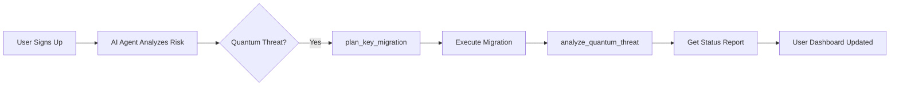

# MCP (Model Context Protocol) Integration - QuantumShield Vault

## Overview

QuantumShield Vault integrates with FastMCP to expose cryptographic wallet operations as tools for AI agents. This enables automated key rotation, threat analysis, and migration planning through AI-driven workflows.

## MCP Architecture

```
┌──────────────────────────────────┐
│     AI Agent (Claude, etc.)      │
├──────────────────────────────────┤
│      Uses MCP Tools API          │
│  ┌────────────────────────────┐  │
│  │ @mcp.tool() Decorators    │  │
│  │ - plan_key_migration()    │  │
│  │ - execute_migration()     │  │
│  │ - analyze_quantum_threat()│  │
│  │ - get_migration_status()  │  │
│  │ - schedule_batch_migration│  │
│  └────────────────────────────┘  │
└────────────────┬─────────────────┘
                 │
        HTTP/JSON-RPC Protocol
                 │
┌────────────────▼─────────────────┐
│    FastAPI Backend + MCP Server  │
├──────────────────────────────────┤
│  mcp_tools.py                    │
│  - Crypto operations             │
│  - Database queries              │
│  - Business logic                │
└────────────────┬─────────────────┘
                 │
         Database & Storage
```

## MCP Tools Available

### 1. **plan_key_migration**
AI agent plan for migrating user wallets from ECDSA to Dilithium.

```python
@mcp.tool()
async def plan_key_migration(
    user_id: int,
    wallet_id: int,
    schedule_days_ahead: int = 0
) -> dict[str, Any]:
    """
    AI agent tool: Plan migration from ECDSA to Dilithium keys.
    """
```

**Input:**
- `user_id`: User requesting migration
- `wallet_id`: Which wallet to migrate
- `schedule_days_ahead`: Delay before execution (0 = immediate)

**Output:**
```json
{
  "status": "planned",
  "wallet_id": 1,
  "migration_type": "ECDSA_secp256k1_to_Dilithium",
  "priority": "high",
  "reason": "Quantum threat expected by 2027",
  "schedule_days": 0,
  "plan": {
    "phase_1": "Key generation (5s)",
    "phase_2": "Balance transfer (10s)",
    "phase_3": "Signature verification (15s)",
    "phase_4": "Cleanup (15s)"
  },
  "recommendation": "Migrate immediately to ensure quantum safety"
}
```

**Use Cases:**
- AI agent analyzes user's risk profile
- Recommends immediate migration for vulnerable wallets
- Schedules batch migrations during low traffic

---

### 2. **execute_migration**
Execute the planned migration, creating Dilithium keys and transferring balance.

```python
@mcp.tool()
async def execute_migration(
    user_id: int,
    wallet_id: int,
    db: Session = None
) -> dict[str, Any]:
    """
    AI agent tool: Execute key migration.
    """
```

**Input:**
- `user_id`: User ID
- `wallet_id`: Wallet to migrate
- `db`: Database session (injected)

**Output:**
```json
{
  "status": "success",
  "wallet_id": 1,
  "old_algorithm": "ECDSA-secp256k1",
  "new_algorithm": "Dilithium",
  "old_address": "0x1234567890abcdef...",
  "new_public_key_fingerprint": "3f4a5b6c7d8e9f0a",
  "balance_transferred": 1.0,
  "migration_id": 42
}
```

**Workflow:**
1. Validate wallet exists and not already migrated
2. Generate Dilithium keypair
3. Create migration log
4. Return new keys and metadata

---

### 3. **analyze_quantum_threat**
AI threat analysis for quantum vulnerability.

```python
@mcp.tool()
async def analyze_quantum_threat(wallet_id: int) -> dict[str, Any]:
    """
    AI agent tool: Analyze quantum threat to a wallet.
    """
```

**Output:**
```json
{
  "wallet_id": 1,
  "current_threat_level": "CRITICAL_2027",
  "vulnerability": "ECDSA-secp256k1 breakable by quantum computer",
  "quantum_break_time": "~30 seconds with 10M qubit quantum computer",
  "threat_timeline": "End of 2026 - early 2027",
  "migration_urgency": "IMMEDIATE",
  "recommendation": "Migrate to Dilithium before Q4 2026",
  "post_migration_threat": "NONE (Dilithium is quantum-resistant)"
}
```

**AI Use:**
- Assess urgency for each user
- Prioritize migrations by risk level
- Generate compliance reports

---

### 4. **get_migration_status**
Retrieve migration status for all user wallets.

```python
@mcp.tool()
async def get_migration_status(user_id: int) -> dict[str, Any]:
    """
    AI agent tool: Get migration status for all user wallets.
    """
```

**Output:**
```json
{
  "status": "retrieved",
  "user_id": 1,
  "summary": {
    "total_wallets": 3,
    "migrated_wallets": 1,
    "vulnerable_wallets": 2,
    "pending_migrations": 0
  },
  "wallets": [
    {
      "wallet_id": 1,
      "name": "Main Wallet",
      "status": "migrated",
      "balance": 5.0
    }
  ]
}
```

---

### 5. **schedule_batch_migration**
Schedule simultaneous migration of multiple wallets.

```python
@mcp.tool()
async def schedule_batch_migration(
    user_id: int,
    days_ahead: int = 7
) -> dict[str, Any]:
    """
    AI agent tool: Schedule batch migration for user's wallets.
    """
```

**Output:**
```json
{
  "status": "scheduled",
  "user_id": 1,
  "batch_size": 3,
  "start_date": "In 7 days",
  "estimated_completion_hours": 1,
  "wallets_scheduled": [1, 2, 3]
}
```

---

## Integration Workflow: Example

### Scenario: User Onboarding



### Code Example: AI Agent Orchestration

```python
# In a hypothetical AI agent (Claude, etc.)
# The agent uses these MCP tools to orchestrate migration

conversation = """
User: "Secure my crypto wallet against quantum attacks"

Agent Analysis:
1. Call get_migration_status(user_id=1)
   → Found 3 wallets, 2 are vulnerable

2. For each vulnerable wallet:
   - Call analyze_quantum_threat(wallet_id)
   - Assess urgency (all CRITICAL)

3. Call plan_key_migration(user_id=1, wallet_id=1)
   → Generated migration plan

4. User confirms → execute_migration(user_id=1, wallet_id=1)
   → Dilithium keys created, balance transferred

5. Verify with analyze_quantum_threat(wallet_id=1)
   → Threat status: NONE (post-migration)

Result: ✓ User protected against 2027 quantum threat
"""
```

---

## MCP Server Configuration

### Starting the MCP Server

```python
# In backend/main.py
from mcp_tools import get_mcp_server

mcp_server = get_mcp_server()

# The server is initialized and exposes tools to AI agents
```

### Environment Setup

```bash
# Install MCP dependencies
pip install fastmcp>=0.1.0

# Environment variables for secure MCP
export MCP_API_KEY=your_secure_key
export MCP_ALLOWED_ORIGINS=https://trusted-agent.com
```

### Testing MCP Tools

```bash
# Health check
curl http://localhost:8000/health

# List available tools (auto-discovered from @mcp.tool() decorators)
curl http://localhost:8000/mcp/tools

# Call tool directly (if exposed as REST endpoint)
curl -X POST http://localhost:8000/mcp/execute \
  -H "Content-Type: application/json" \
  -d '{
    "tool": "analyze_quantum_threat",
    "params": {"wallet_id": 1}
  }'
```

---

## AI Agent Use Cases

### 1. **Automated Migration Assistant**
- Agent monitors user wallets
- Alerts when quantum threat is imminent
- Offers instant migration with one confirmation

```mermaid
User's Wallet Status
├─ Wallet A: ECDSA (High Risk)
├─ Wallet B: ECDSA (High Risk)
└─ Wallet C: Dilithium (Secured)

Agent recommends: Migrate A & B immediately
Agent suggests: Schedule migration during off-peak hours
Agent provides: Cost estimate + time estimate
```

### 2. **Compliance Auditor**
- AI agent generates audit reports
- Tracks migration timeline per user
- Generates compliance certifications

```python
# AI agent workflow
audit_report = []
for user in all_users:
    status = await get_migration_status(user.id)
    if status['vulnerable_wallets'] > 0:
        threat = await analyze_quantum_threat(status['wallets'][0])
        audit_report.append({
            'user': user,
            'vulnerable': status['vulnerable_wallets'],
            'threat_level': threat['threat_level'],
            'recommendation': threat['recommendation']
        })
return generate_compliance_report(audit_report)
```

### 3. **Batch Migration Scheduler**
- Agent plans migrations across user base
- Schedules to minimize infrastructure load
- Monitors migration progress

```python
# Batch migration orchestration
batch = await schedule_batch_migration(
    user_id=1,
    days_ahead=7  # Start in 1 week
)
# Later: execute_migration() called automatically
```

### 4. **Educational Chatbot**
- Agent explains quantum threats
- Guides users through migration
- Answers FAQ about Dilithium vs ECDSA

---

## MCP Protocol Details

### Tool Definition Format

Each MCP tool follows this format:

```python
@mcp.tool()
async def tool_name(
    param1: type1,
    param2: type2,
    db: Session = None  # Optional database injection
) -> dict[str, Any]:
    """
    Summary of tool purpose.
    
    Args:
        param1: Description
        param2: Description
    
    Returns:
        Dictionary with results
    """
    # Implementation
    return result
```

### JSON-RPC Interface

```json
// Request
{
  "jsonrpc": "2.0",
  "id": 1,
  "method": "plan_key_migration",
  "params": {
    "user_id": 1,
    "wallet_id": 1,
    "schedule_days_ahead": 0
  }
}

// Response
{
  "jsonrpc": "2.0",
  "id": 1,
  "result": {
    "status": "planned",
    "wallet_id": 1,
    ...
  }
}
```

---

## Error Handling

### Common Errors

```python
# Wallet not found
{
  "error": "Wallet not found",
  "status": "failed",
  "wallet_id": 999
}

# Wallet already migrated
{
  "error": "Wallet already migrated",
  "status": "failed",
  "wallet_id": 1
}

# Database error
{
  "error": "Database session required",
  "status": "failed"
}
```

---

## Future Enhancements

### Planned MCP Tools
- `estimate_migration_cost()` - Cost estimation
- `get_quantum_timeline()` - Threat timeline forecasting
- `export_audit_report()` - Compliance reporting
- `validate_key_safety()` - Security verification
- `batch_verify_signatures()` - Mass validation

### AI Integration Opportunities
- Natural language threat assessment
- Personalized migration recommendations
- Real-time portfolio analysis
- Predictive threat modeling
- Automated incident response

---

## Best Practices

### For AI Agents Using MCP Tools

1. **Always Verify Before Migration**
   ```python
   # 1. Get current status
   status = get_migration_status(user_id)
   
   # 2. Analyze threat
   threat = analyze_quantum_threat(wallet_id)
   
   # 3. Get migration plan
   plan = plan_key_migration(user_id, wallet_id)
   
   # 4. Execute only with confirmation
   result = execute_migration(user_id, wallet_id)
   ```

2. **Handle Async Operations**
   ```python
   # Migration can take time, monitor progress
   migration_status = get_migration_status(user_id)
   while migration_status['pending_migrations'] > 0:
       time.sleep(5)
       migration_status = get_migration_status(user_id)
   ```

3. **Provide User Feedback**
   - Show migration plans before execution
   - Display quantum threat level clearly
   - Offer scheduling options
   - Confirm with user before proceeding

---

## Security Considerations

### API Key Authentication
```python
# In production, require MCP API keys
headers = {
    "X-MCP-API-Key": "your_secure_key"
}
```

### Rate Limiting
```python
# Prevent abuse of migration tools
# 1 migration per wallet per day
# 10 total migrations per user per week
```

### Audit Logging
```python
# All MCP tool calls logged
audit_log = {
    "timestamp": datetime.utcnow(),
    "agent": agent_id,
    "tool": "execute_migration",
    "user_id": 1,
    "wallet_id": 1,
    "result": success
}
```

---

## Testing MCP Tools

```bash
# Test tool availability
curl -X GET http://localhost:8000/mcp/tools

# Test tool execution
pytest backend/tests/test_mcp_tools.py -v

# Load test with concurrent calls
locust -f tests/load_test_mcp.py --host=http://localhost:8000
```

---

## Documentation Links

- [FastMCP Documentation](https://github.com/jlopp/fastmcp)
- [Claude MCP Documentation](https://modelcontextprotocol.io)
- [Our API Specification](./openapi.yaml)
- [Backend Implementation](./backend/mcp_tools.py)

---

## Support

For MCP integration questions:
- Check [backend/mcp_tools.py](backend/mcp_tools.py) for source
- Review [backend/tests/test_backend.py](backend/tests/test_backend.py) for usage examples
- Open GitHub issue for bugs or feature requests
